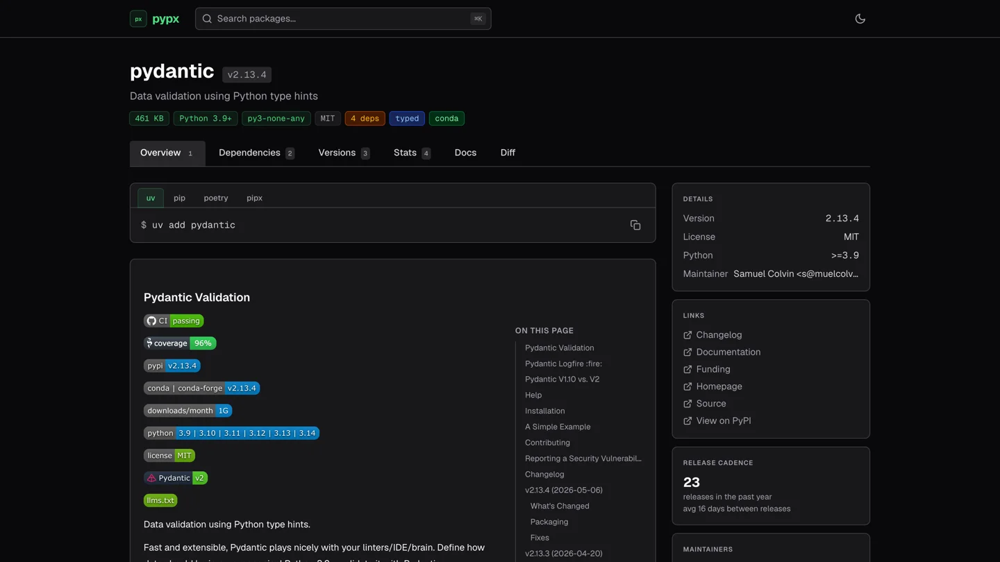
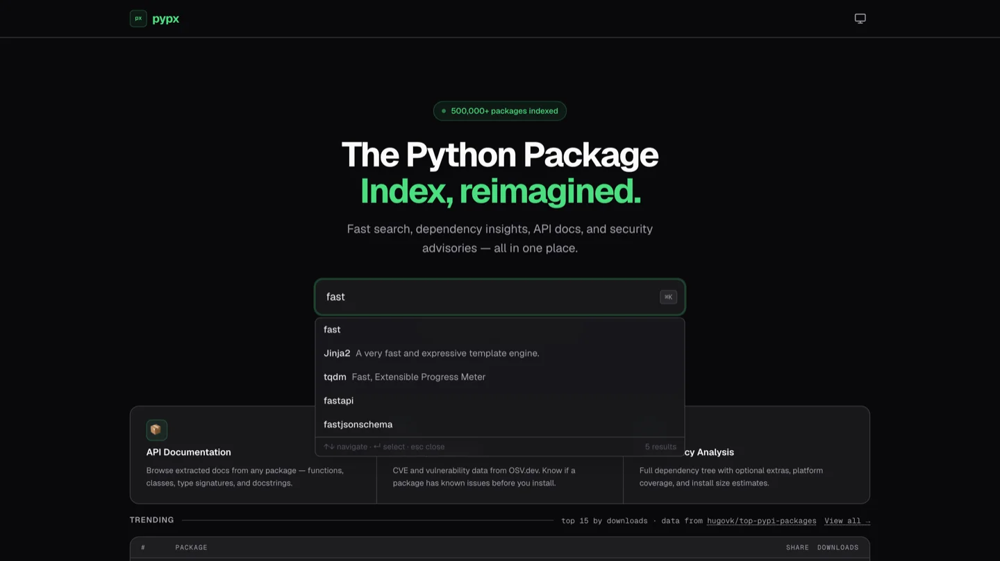
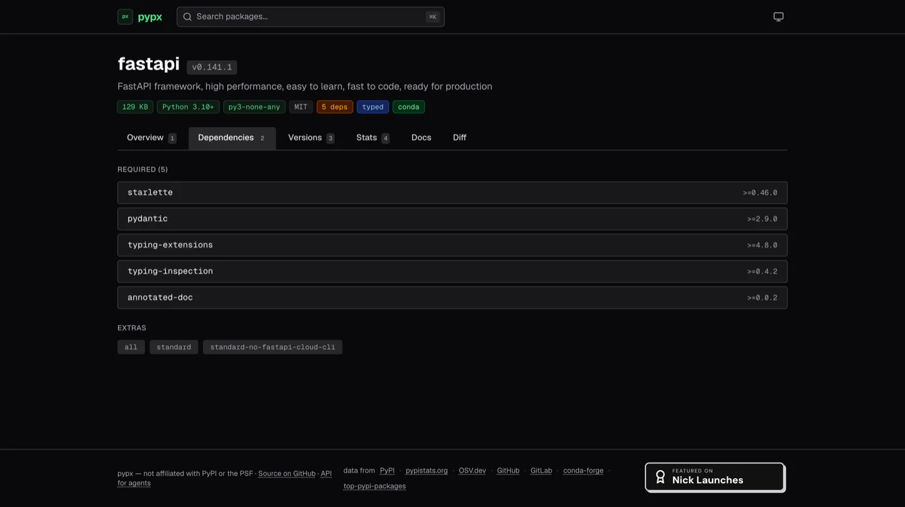
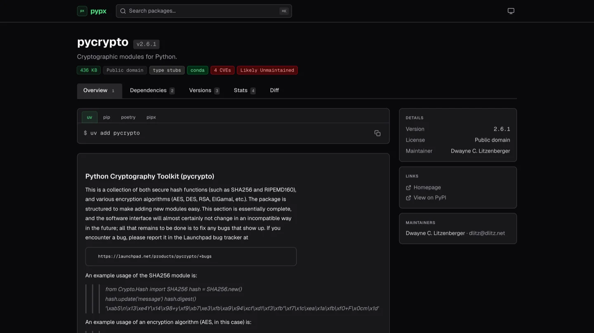
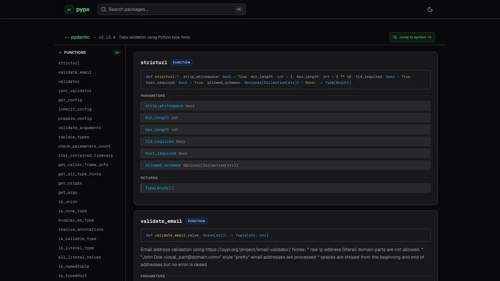
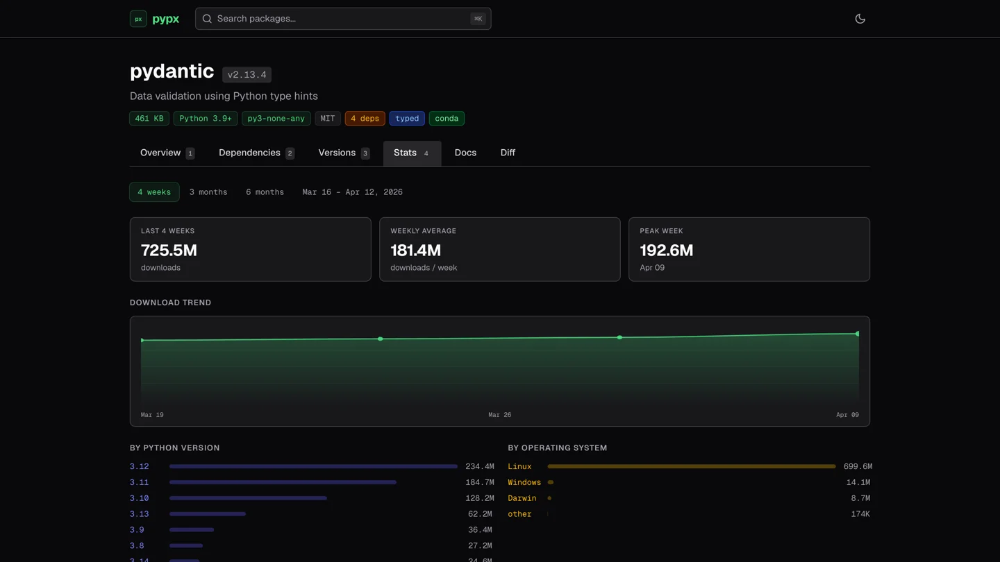
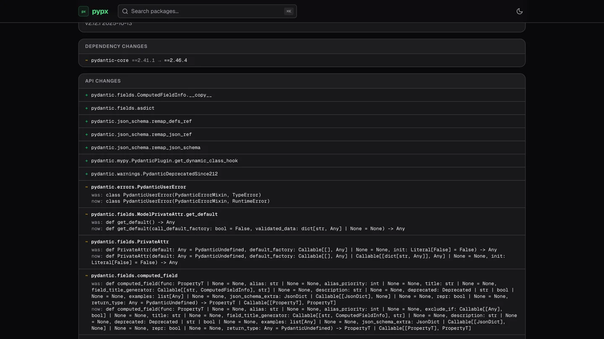

<div align="center">


# pypx

**The Python Package Index, reimagined.**

Search, dependency insights, security advisories, and API docs for 780K+ Python packages.

[](https://pypx.app)

[](https://github.com/mattstrayer/pypx/actions/workflows/ci.yml)
[](https://github.com/mattstrayer/pypx/actions/workflows/codeql.yml)
[](https://scorecard.dev/viewer/?uri=github.com/mattstrayer/pypx)
[](LICENSE)
[](https://golang.org)
[](https://nuxt.com)
[](https://github.com/mattstrayer/pypx/discussions)

**[→ Try it live at pypx.app](https://pypx.app)** · inspired by [npmx.dev](https://npmx.dev)

</div>

---

[](https://pypx.app/packages/pydantic)

<table>
<tr>
<td width="50%">
<a href="https://pypx.app"></a>
<p align="center"><sub><b>⌘K instant search</b> — results as you type</sub></p>
</td>
<td width="50%">
<a href="https://pypx.app/packages/fastapi"></a>
<p align="center"><sub><b>Dependency tree</b> — PEP 508 parsed, extras split out</sub></p>
</td>
</tr>
<tr>
<td width="50%">
<a href="https://pypx.app/packages/pycrypto"></a>
<p align="center"><sub><b>Security warnings</b> — OSV CVEs and maintenance flags, before you install</sub></p>
</td>
<td width="50%">
<a href="https://pypx.app/packages/fastapi/docs"></a>
<p align="center"><sub><b>API docs from wheels</b> — signatures and docstrings, extracted in-process</sub></p>
</td>
</tr>
<tr>
<td width="50%">
<a href="https://pypx.app/packages/fastapi"></a>
<p align="center"><sub><b>Download trends</b> — by Python version and OS</sub></p>
</td>
<td width="50%">
<a href="https://pypx.app/packages/fastapi/diff"></a>
<p align="center"><sub><b>Version diff</b> — what changed between two releases</sub></p>
</td>
</tr>
</table>

---

## Why

pypx pulls together the things you actually check before adding a new dependency or bumping an existing one: how big it is, what it pulls in, whether it's still maintained, what changed since the version you're on, and what the API looks like — without opening six tabs.

Everything comes from public APIs (PyPI, pypistats, OSV, conda-forge). pypx is a companion to the packaging ecosystem, not a replacement for any part of it.

---

## Features

**Discover**

- **Instant search** — typeahead and a `Cmd+K` command palette, backed by SQLite FTS5 — [try it →](https://pypx.app)
- **Popular packages** — top packages by 30-day downloads — [browse →](https://pypx.app/popular)
- **Compare** — up to 5 packages side by side — [compare →](https://pypx.app/compare)

**Dig deeper**

- **Package insights** — install size, wheel platform coverage, Python version compatibility, release cadence
- **Dependency tree** — parsed PEP 508 `requires_dist` with required vs. optional extras split out
- **Download trends** — 4-week, 3-month, and 6-month charts broken down by Python version and OS
- **Inline changelogs** — GitHub Releases, CHANGELOG.md files, and GitLab Releases rendered as markdown
- **API docs** — extracted in-process from published wheels via goopy: modules, signatures, docstrings — [see fastapi's →](https://pypx.app/packages/fastapi/docs)
- **Version diff** — compare any two releases of a package

**Secure**

- **Security advisories** — OSV database CVE data per package, flagged right on the package header when the version you're viewing is affected — [see pycrypto's →](https://pypx.app/packages/pycrypto)
- **Maintenance signals** — unmaintained-package warnings from release cadence and repository activity

**Developer experience**

- **Install command switcher** — pip, uv, poetry, and pipx commands with one-click copy
- **Dark-first terminal aesthetic** — Geist fonts, zinc palette, full keyboard navigation
- **SSR + edge caching** — fast initial loads via Nuxt SSR, Cloudflare edge caching for repeat visits

---

## Built for agents, too

Every page has a plain-text twin, so coding agents and LLMs can pull what they need without parsing HTML. Discovery starts at [`pypx.app/llms.txt`](https://pypx.app/llms.txt):

```bash
curl https://pypx.app/api/packages/requests/summary.txt   # ≤2KB agent briefing
curl https://pypx.app/api/packages/requests/security.txt  # CVE list, plain text
curl "https://pypx.app/api/search.txt?q=http+client"      # TSV search results
```

The full list of `.txt` routes is in [API Endpoints](#api-endpoints).

---

## Quick Start

Run your own instance with Docker Compose:

```bash
git clone https://github.com/mattstrayer/pypx.git
cd pypx
cp .env.example .env        # add GITHUB_TOKEN for higher rate limits (optional)
docker compose up --build
```

Visit [http://localhost](http://localhost).

> On first boot the background worker syncs the full PyPI package index (~780K names). Search results populate within a few minutes — after that it's instant.

---

## Configuration

| Variable | Default | Description |
|---|---|---|
| `DOMAIN` | `localhost` | Domain for Caddy TLS certificate (e.g. `pypx.app`) |
| `GITHUB_TOKEN` | _(empty)_ | GitHub PAT — raises API rate limit from 60 to 5,000 req/hr |
| `GITLAB_TOKEN` | _(empty)_ | GitLab PAT for GitLab-hosted packages |
| `API_PORT` | `8080` | Go API listen port |
| `SQLITE_PATH` | `pypx.db` | SQLite database path (cache + search index live alongside it) |
| `NUXT_API_BASE` | `http://localhost:8080/api` | Server-side API URL used by Nuxt SSR |
| `NUXT_PUBLIC_API_BASE` | `/api` | Client-side API base (proxied through Caddy in production) |

In Docker Compose, `NUXT_API_BASE` is automatically set to the internal `http://api:8080/api` address. You only need to provide `DOMAIN`, `GITHUB_TOKEN`, and optionally `GITLAB_TOKEN` in your `.env`.

---

## Architecture

```
Browser → Cloudflare → Caddy → Nuxt SSR    (port 3000)
                             → Go API      (port 8080)
```

- **Go API** — chi-based HTTP server. Orchestrates PyPI, pypistats, GitHub, GitLab, OSV, and conda-forge. Two-tier cache (LRU memory + SQLite). Background worker syncs 780K+ package names into an FTS5 search index every 6 hours. API doc extraction runs in-process via goopy (pure Go wheel parser).
- **Nuxt 4** — SSR frontend in Vue 3 + Tailwind 4. Critical data fetched server-side; secondary data (changelog, security, docs) loaded in parallel client-side after render.
- **Caddy** — automatic TLS, routes `/api/*` to Go API, everything else to Nuxt.
- **Cloudflare** — edge caching, DDoS protection, bot management.

Full architecture documentation: [`docs/architecture/`](docs/architecture/)

---

## API Endpoints

| Endpoint | Cache TTL | Description |
|---|---|---|
| `GET /api/health` | — | Health check |
| `GET /api/packages/{name}` | 1 hour | Enriched package metadata |
| `GET /api/packages/{name}/versions` | 1 hour | Full version history with file lists |
| `GET /api/packages/{name}/dependencies` | 1 hour | Parsed dependency tree with extras |
| `GET /api/packages/{name}/stats?period=4w\|3m\|6m` | 24 hours | Download trends and breakdowns |
| `GET /api/packages/{name}/changelog` | 7 days | Changelog from GitHub/GitLab/file sources |
| `GET /api/packages/{name}/security` | 24 hours | OSV vulnerability advisories |
| `GET /api/packages/{name}/extras` | 24 hours | Type annotation support, conda-forge availability |
| `GET /api/packages/{name}/docs` | Indefinite | API docs extracted in-process from wheel via goopy |
| `GET /api/search?q=...&limit=20` | 5 minutes | FTS5 full-text package search |
| `GET /api/popular` | 1 hour | Top packages by 30-day downloads |

### Agentic plain-text endpoints

| Endpoint | Cache TTL | Content-Type | Description |
|---|---|---|---|
| `GET /llms.txt` | 1 hour | `text/plain; charset=utf-8` | Discovery index of available `.txt` routes |
| `GET /api/packages/{name}.txt` | 1 hour | `text/plain; charset=utf-8` | Package metadata (key:value pairs + dependencies) |
| `GET /api/packages/{name}/changelog.txt` | 7 days | `text/plain; charset=utf-8` | Markdown changelog (one section per version) |
| `GET /api/packages/{name}/security.txt` | 24 hours | `text/plain; charset=utf-8` | Vulnerability list (supports `?version=`) |
| `GET /api/packages/{name}/extras.txt` | 24 hours | `text/plain; charset=utf-8` | Type support, conda-forge availability, repo info |
| `GET /api/packages/{name}/summary.txt` | 1 hour | `text/plain; charset=utf-8` | Agent briefing (≤2KB) |
| `GET /api/search.txt?q=...&limit=` | 5 minutes | `text/plain; charset=utf-8` | TSV search results (name, downloads, summary) |
| `GET /api/packages/{name}/docs.txt?prefix=` | Indefinite | `text/plain; charset=utf-8` | API documentation; supports `?prefix=` filter |
| `GET /api/packages/{name}/docs/{symbol}.txt` | Indefinite | `text/plain; charset=utf-8` | Single symbol by dotted path |
| `GET /api/packages/{name}/symbols.txt?q=&kind=&limit=` | Indefinite | `text/plain; charset=utf-8` | TSV symbol search with filters |
| `GET /api/packages/{name}/diff.txt?from=&to=` | Indefinite | `text/plain; charset=utf-8` | Diff between two versions |
| `GET /api/compare.txt?pkgs=` | 1 hour | `text/plain; charset=utf-8` | Side-by-side compare of up to 5 packages |

---

## Development

**Prerequisites:** Go 1.26+, Node.js 20+ with pnpm, Docker + Compose

```bash
make install      # web dependencies (pnpm via mise)
make dev          # API on :8080 + Nuxt on :3000
make test         # all test suites (api, goopy, web)
make lint         # go vet + oxlint
```

All targets are defined in the root Makefile — run make help for the full list.

The Nuxt dev server proxies `/api/*` to `localhost:8080` automatically (via `docker-compose.override.yml` which configures local development proxying).

---

## Tech Stack

| Layer | Technology |
|---|---|
| API | Go 1.26, chi v5, goldmark, modernc.org/sqlite |
| Frontend | Nuxt 4, Vue 3, Tailwind 4, VueUse, @nuxtjs/seo |
| Search | SQLite FTS5 (porter + unicode61 tokenizer) |
| Cache | SQLite (persistent TTL) + in-memory LRU (1,000 entries) |
| Doc extraction | Go, goopy (in-process wheel parser) |
| Proxy | Caddy 2 (automatic TLS) |
| Deploy | Docker Compose, DigitalOcean Droplet, Cloudflare |

---

## Contributing

Pull requests, bug reports, and feature ideas are all welcome. Start with [`CONTRIBUTING.md`](CONTRIBUTING.md) for setup and conventions, and please read the [Code of Conduct](CODE_OF_CONDUCT.md) before participating. If a package's docs render wrong or its changelog doesn't show up, an issue with the package name is enough — those reports drive most of the improvements to goopy and the changelog sources.

- File bugs or feature requests via [GitHub Issues](https://github.com/mattstrayer/pypx/issues)
- Commit messages and PR titles follow [Conventional Commits](https://www.conventionalcommits.org/): `feat:`, `fix:`, `refactor:`, `docs:`, `chore:`, `test:`
- One logical change per PR; run `go test ./...` and `pnpm run test` before pushing

To report a security vulnerability, follow the disclosure process in [`SECURITY.md`](SECURITY.md) — please do **not** open a public issue.

---

## Acknowledgements

pypx stands on a lot of public infrastructure. Huge thanks to the maintainers of:

- **[PyPI](https://pypi.org/)** and the [Python Packaging Authority](https://www.pypa.io/) — package metadata and the `simple` index
- **[pypistats.org](https://pypistats.org/)** — aggregated download statistics
- **[OSV.dev](https://osv.dev/)** — open-source vulnerability database
- **[conda-forge](https://conda-forge.org/)** — community-maintained Conda channel
- **[hugovk/top-pypi-packages](https://github.com/hugovk/top-pypi-packages)** — Hugo van Kemenade's top-PyPI-packages dataset
- **[GitHub](https://github.com/)** and **[GitLab](https://gitlab.com/)** — release notes, READMEs, and repository metadata
- **[Geist](https://vercel.com/font)** — typography
- Inspiration from **[npmx.dev](https://npmx.dev)**

pypx is not affiliated with the Python Software Foundation, the Python Packaging Authority, or any of the services it consumes.

---

## License

[MIT](LICENSE)
