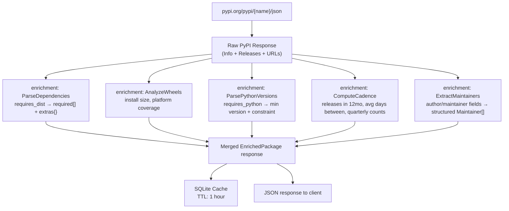

# Go API

The Go API is the data layer of pypx. It is a lightweight chi-based HTTP server that fetches from multiple external sources, enriches raw data, caches results, and serves JSON.

**Source:** `api/`  
**Entry point:** `api/cmd/server/main.go`  
**Listen port:** `8080`

## Routing

All routes have a **30-second timeout** except `/api/packages/{name}/docs` which has **60 seconds** (to accommodate wheel download and goopy parse time).

```mermaid
graph TD
    Router["chi Router"]
    Router --> Health["GET /api/health"]
    Router --> Pkg["GET /api/packages/{name}"]
    Router --> Versions["GET /api/packages/{name}/versions"]
    Router --> Deps["GET /api/packages/{name}/dependencies"]
    Router --> Stats["GET /api/packages/{name}/stats?period=4w|3m|6m"]
    Router --> Changelog["GET /api/packages/{name}/changelog"]
    Router --> Security["GET /api/packages/{name}/security"]
    Router --> Extras["GET /api/packages/{name}/extras"]
    Router --> Docs["GET /api/packages/{name}/docs\n(60s timeout)"]
    Router --> Search["GET /api/search?q=...&limit=20"]
    Router --> Popular["GET /api/popular"]
    
    Router --> LLMS["GET /llms.txt"]
    Router --> PkgTxt["GET /api/packages/{name}.txt"]
    Router --> ChangelogTxt["GET /api/packages/{name}/changelog.txt"]
    Router --> SecurityTxt["GET /api/packages/{name}/security.txt"]
    Router --> ExtrasTxt["GET /api/packages/{name}/extras.txt"]
    Router --> SummaryTxt["GET /api/packages/{name}/summary.txt"]
    Router --> SearchTxt["GET /api/search.txt?q=...&limit="]
    Router --> DocsTxt["GET /api/packages/{name}/docs.txt?prefix="]
    Router --> SymbolTxt["GET /api/packages/{name}/docs/{symbol}.txt"]
    Router --> SymbolsSearchTxt["GET /api/packages/{name}/symbols.txt?q="]
```



## Endpoints

| Endpoint | Handler | Cache TTL | Notes |
|---|---|---|---|
| `GET /api/health` | `handler.Health` | — | Always 200 OK |
| `GET /api/packages/{name}` | `PackageHandler.Get` | 1 hour | Core enriched metadata |
| `GET /api/packages/{name}/versions` | `PackageHandler.GetVersions` | 1 hour | All releases with file lists |
| `GET /api/packages/{name}/dependencies` | `PackageHandler.GetDependencies` | 1 hour | Parsed PEP 508 requires_dist |
| `GET /api/packages/{name}/stats` | `StatsHandler.Get` | 24 hours | Aggregated download trends |
| `GET /api/packages/{name}/changelog` | `ChangelogHandler.Get` | 7 days | Rendered markdown/HTML |
| `GET /api/packages/{name}/security` | `SecurityHandler.Get` | 24 hours | OSV vulnerability advisories |
| `GET /api/packages/{name}/extras` | `ExtrasHandler.Get` | 24 hours | Type stubs, conda-forge |
| `GET /api/packages/{name}/docs` | `DocsHandler.Get` | Indefinite | goopy API docs per version |
| `GET /api/search` | `SearchHandler.Search` | HTTP header 5m | FTS5 search results |
| `GET /api/popular` | `PopularHandler.Get` | 1 hour | Top packages by downloads |
| `GET /llms.txt` | `LLMSHandler.ServeHTTP` | 1 hour | Plain-text discovery index |
| `GET /api/packages/{name}.txt` | `PackageHandler.GetText` | 1 hour | Plain-text package metadata |
| `GET /api/packages/{name}/changelog.txt` | `ChangelogHandler.GetText` | 7 days | Plain-text markdown changelog |
| `GET /api/packages/{name}/security.txt` | `SecurityHandler.GetText` | 24 hours | Plain-text vulnerability list |
| `GET /api/packages/{name}/extras.txt` | `ExtrasHandler.GetText` | 24 hours | Plain-text extras (type, conda, repo) |
| `GET /api/packages/{name}/summary.txt` | `PackageHandler.GetSummary` | 1 hour | Plain-text agent briefing |
| `GET /api/search.txt` | `SearchHandler.SearchText` | HTTP header 5m | TSV search results |
| `GET /api/packages/{name}/docs.txt` | `DocsHandler.GetText` | Indefinite | Plain-text API docs with optional prefix filter |
| `GET /api/packages/{name}/docs/{symbol}.txt` | `DocsHandler.GetSymbolText` | Indefinite | Plain-text single symbol (dotted path) |
| `GET /api/packages/{name}/symbols.txt` | `DocsHandler.SearchSymbols` | Indefinite | TSV symbol search with filters |

## Enrichment Pipeline

The core package endpoint (`GET /api/packages/{name}`) does the most work. When the cache misses, it fetches the raw PyPI response and runs it through the enrichment layer.



All enrichment functions are pure — no I/O, no side effects. They live in `api/internal/enrichment/`.

## Package Name Validation

Package names are validated before any external call is made. Valid characters: alphanumeric, hyphen (`-`), underscore (`_`), dot (`.`). Invalid names return 400 immediately. This prevents cache poisoning and unnecessary upstream requests.

## CORS

The API allows cross-origin requests from `http://localhost:3000` (dev) and `https://pypx.app` (prod). Only `GET` and `OPTIONS` methods are permitted.

## Graceful Shutdown

On `SIGINT` or `SIGTERM`, the server stops accepting new connections and waits up to 10 seconds for in-flight requests to complete before exiting.

## Response Shape (Package Endpoint)

The `GET /api/packages/{name}` response merges PyPI data with enrichments:

```
{
  name, version, summary, description, description_content_type,
  home_page, project_url, docs_url, requires_python,
  license, keywords, classifiers[],

  // enriched
  maintainers[]:     { name, email }
  dependencies:      { required[], extras{name: []} }
  python_versions:   { min_version, constraint }
  wheels:            { install_size_bytes, formats[], platforms[] }
  cadence:           { releases_last_12mo, avg_days_between, quarterly[], last_release_at }

  // from PyPI URLs
  latest_files[]:    { filename, size, upload_time, python_version, requires_python, digests{} }
}
```
