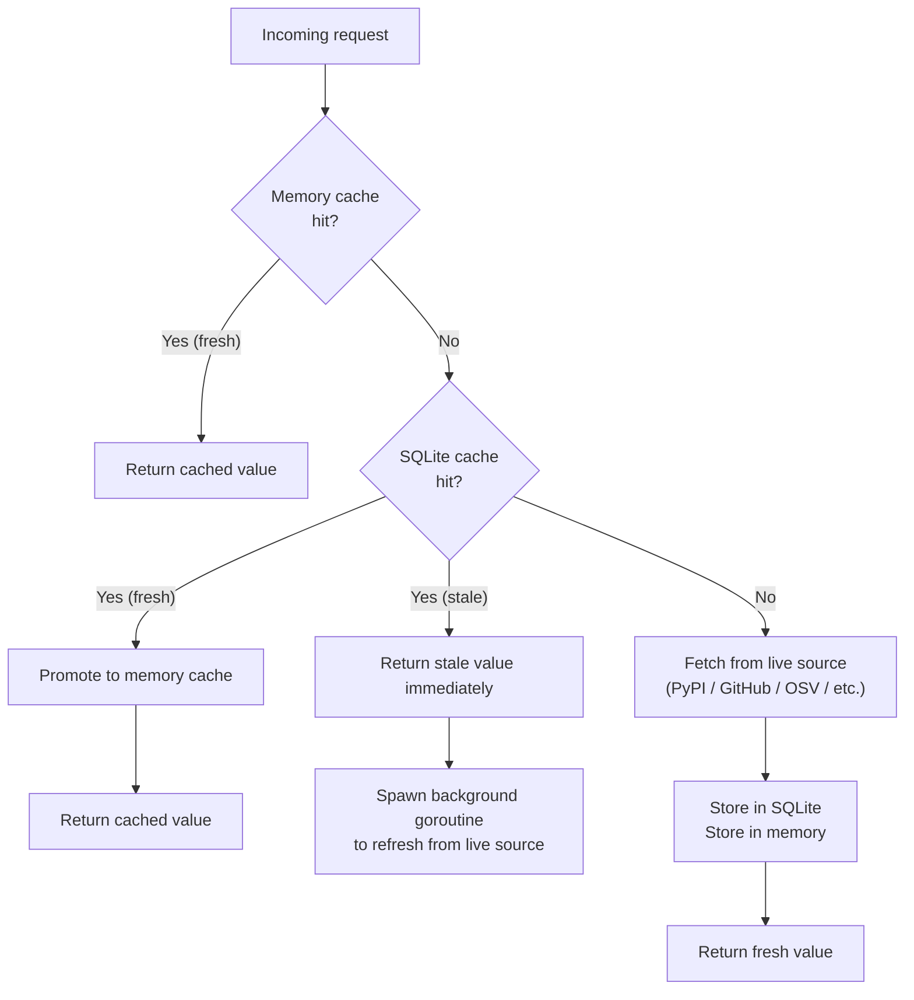
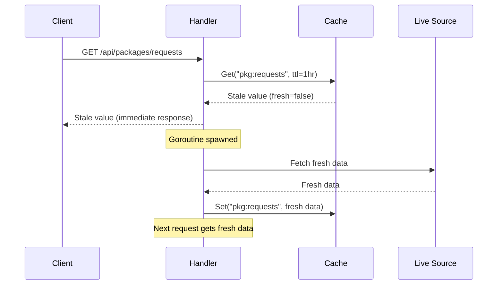

# Caching

pypx uses a two-tier cache: a fast in-memory LRU layer in front of a persistent SQLite TTL store. All API responses (except search) pass through this cache.

**Source:** `api/internal/cache/`

## Architecture



## Memory Cache (`cache/memory.go`)

An LRU (least-recently-used) cache holding up to **1,000 entries** in process memory.

- Initialized at startup: `cache.NewMemoryCache(sqliteCache, 1000)`
- On a hit: returns the value immediately, no disk I/O
- On a miss: delegates to SQLite, then promotes the result to memory
- On eviction: removes the oldest entry when capacity is exceeded
- Not persisted — cleared on process restart (SQLite serves as the durable backing store)

## SQLite Cache (`cache/sqlite.go`)

A persistent TTL-based key-value store backed by SQLite.

**Schema:**
```sql
CREATE TABLE cache (
    key        TEXT    PRIMARY KEY,
    value      BLOB    NOT NULL,
    created_at INTEGER NOT NULL  -- Unix timestamp
)
```

WAL mode is enabled for concurrent read performance (multiple goroutines can read simultaneously without blocking).

**Operations:**
- `Get(key, ttl)` — returns `(value, fresh bool, err)`. If `created_at + ttl < now`, returns value with `fresh=false`.
- `Set(key, value)` — upserts with current timestamp.
- `Delete(key)` — explicit invalidation (not currently used, reserved for future use).

## Stale-While-Revalidate

For most endpoints, pypx serves stale data immediately and refreshes in the background. This keeps response times fast even when cache entries have expired.



Endpoints that use stale-while-revalidate: package metadata, stats, security, extras, popular.

Endpoints that do **not** use stale-while-revalidate: changelog (7-day TTL is long enough), docs (indefinite TTL — keyed by version, so a version's docs never change).

## Cache Key Naming

| Pattern | Example | TTL |
|---|---|---|
| `raw:{name}` | `raw:requests` | 1 hour |
| `pkg:{name}` | `pkg:requests` | 1 hour |
| `stats:{name}:{period}` | `stats:requests:4w` | 24 hours |
| `changelog:{name}` | `changelog:requests` | 7 days |
| `security:{name}` | `security:requests` | 24 hours |
| `extras:{name}` | `extras:requests` | 24 hours |
| `docs:{name}:{version}` | `docs:requests:2.31.0` | Indefinite (0 = no expiry) |
| `docs-err:{name}:{version}` | `docs-err:requests:2.31.0` | 5 minutes |
| `popular` | `popular` | 1 hour |

## HTTP Cache-Control Headers

The API also sets `Cache-Control` headers on responses, which Cloudflare uses for edge caching:

| Endpoint | `Cache-Control` |
|---|---|
| Package metadata | `public, max-age=3600` (1 hour) |
| Stats | `public, max-age=86400` (24 hours) |
| Changelog | `public, max-age=604800` (7 days) |
| Search | `public, max-age=300` (5 minutes) |
| Docs | `public, max-age=31536000, immutable` (1 year, versioned) |

This means popular packages are served directly from Cloudflare's edge on repeat visits — the Go API is never hit.

## Two-Database Setup

The cache (`pypx.db`) and search index (`pypx.db-search`) are separate SQLite files. This separation:
- Prevents the large FTS5 index from slowing down cache lookups
- Allows different write patterns (cache: frequent small writes; search: bulk batch writes every 6 hours)
- Makes it easy to wipe and rebuild the search index without touching the cache
