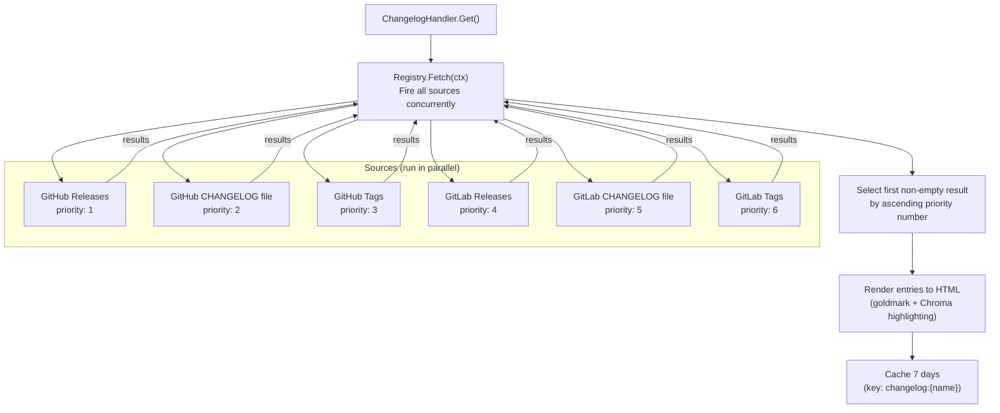
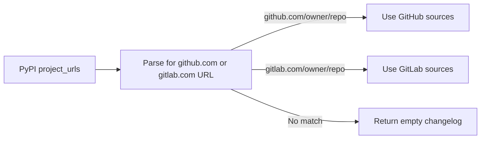

# Changelog

pypx renders changelogs by fetching from multiple possible sources in parallel and returning the first non-empty result. The system is designed to work across the wide variety of how Python packages publish their changes.

**Source:** `api/internal/changelog/`, `api/internal/github/`, `api/internal/gitlab/`

## Source Registry Pattern



## Source Interface

Every source implements a common interface:

```go
type Source interface {
    Fetch(ctx context.Context) ([]Entry, error)
    Priority() int
}

type Entry struct {
    Version   string
    Date      time.Time
    Body      string  // Raw markdown or parsed text
}
```

The registry fires all sources with `go func()` goroutines, collects results into a channel, and after all goroutines complete, picks the first non-empty result sorted by `Priority()`.

## Source Implementations

### GitHub Releases (`github.ReleasesSource`)
Fetches `GET /repos/{owner}/{repo}/releases`. Maps each GitHub release to an `Entry` using the release tag as version, `published_at` as date, and the release body (markdown) as content. Most actively maintained packages use this.

### GitHub File (`github.FileSource`)
Looks for a `CHANGELOG.md`, `CHANGELOG.rst`, `CHANGES.md`, or `HISTORY.md` file in the repo root via `GET /repos/{owner}/{repo}/contents/{path}`. If found, parses the file into versioned entries using the changelog parser.

### GitHub Tags (`github.TagsSource`)
Fetches tag list and commit messages as a fallback for packages that tag releases but don't write release notes.

### GitLab equivalents
`gitlab.ReleasesSource`, `gitlab.FileSource`, `gitlab.TagsSource` — mirror the GitHub implementations but call the GitLab API. Used when the package's `project_url` points to `gitlab.com`.

## Changelog File Parser

The file parser (`changelog/parser.go`) handles `CHANGELOG.md` and similar files. It uses regex to identify version headers in common formats:

```
## [2.31.0] - 2023-05-22      (Keep a Changelog format)
## 2.31.0 (2023-05-22)        (common informal format)
# Version 2.31.0              (RST-style heading)
```

Each matched header starts a new `Entry`. The content between headers becomes the entry body.

## Rendering

Entries are rendered from markdown to HTML using [goldmark](https://github.com/yuin/goldmark) with [Chroma](https://github.com/alecthomas/chroma) syntax highlighting. The rendered HTML is what gets stored in the cache and returned to the frontend.

RST (reStructuredText) descriptions are detected when the PyPI package's `description_content_type` is absent or `text/x-rst`, and rendered appropriately.

## How the Repository URL is Found

The handler inspects the PyPI package's `project_urls` map for keys like `Source`, `Repository`, `Homepage`, `Code`, `GitHub`, and `GitLab`. The first URL matching `github.com/{owner}/{repo}` or `gitlab.com/{owner}/{repo}` is used.



## Cache

Changelog results are cached for **7 days** under the key `changelog:{name}`. This is a long TTL because changelogs change infrequently and the GitHub/GitLab API calls are the most rate-limit-sensitive operations in the system. Unlike most other endpoints, changelog does not use stale-while-revalidate — it simply returns the cached HTML or fetches fresh.
