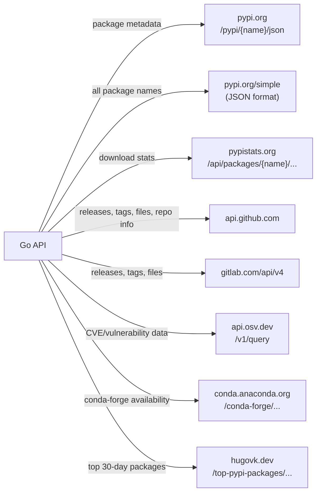

# Data Sources

pypx pulls from seven external services. None require user authentication — GitHub and GitLab tokens are optional rate-limit boosters.

## Map of Sources

## Source Details

### PyPI JSON API
**URL:** `https://pypi.org/pypi/{name}/json`  
**Used by:** Package handler, changelog handler, extras handler, docs handler  
**Provides:**
- `info` — name, version, summary, description, license, classifiers, requires_python, requires_dist, homepage, project URLs
- `releases` — all published versions with file lists (filename, size, upload_time, digests)
- `urls` — latest version's distribution files

**Rate limit:** None documented. pypx caches responses for 1 hour to be a good citizen.  
**Timeout:** 15 seconds  
**Auth:** None

---

### PyPI Simple API (JSON)
**URL:** `https://pypi.org/simple/?format=application/vnd.pypi.simple.v1+json`  
**Used by:** Background worker (`worker/background.go`)  
**Provides:** Full list of all package names (780K+) in a single JSON response  
**Rate limit:** None documented. pypx fetches this once every 6 hours.  
**Timeout:** 120 seconds (large payload)  
**Auth:** None

---

### pypistats.org
**URL:** `https://pypistats.org/api/packages/{name}/{type}`  
**Used by:** Stats handler  
**Types:**
- `overall` — total downloads (all Python versions, all systems)
- `python_minor` — downloads grouped by Python version (3.9, 3.10, 3.11, …)
- `system` — downloads grouped by OS (Linux, Windows, macOS, null)

**Response:** Array of `{ date, category, downloads }` data points  
**Rate limit:** None documented. pypx caches per-package stats for 24 hours.  
**Timeout:** 15 seconds  
**Auth:** None

---

### GitHub API
**URL:** `https://api.github.com`  
**Used by:** Changelog handler  
**Provides:**
- `GET /repos/{owner}/{repo}/releases` — release notes (title, tag, markdown body, published_at)
- `GET /repos/{owner}/{repo}/tags` — tag list (name, commit SHA)
- `GET /repos/{owner}/{repo}/contents/{path}` — raw file contents (for CHANGELOG.md)
- `GET /repos/{owner}/{repo}` — repo metadata (stars, forks, open issues, last push)
- `GET /repos/{owner}/{repo}/compare/{base}...{head}` — commit comparison

**Rate limit:** 60 req/hr unauthenticated, 5,000 req/hr with token  
**Timeout:** 15 seconds  
**Auth:** Optional `GITHUB_TOKEN` env var → `Authorization: Bearer {token}` header

**How the repo URL is found:** The PyPI package's `project_urls` field is parsed for GitHub URLs. If found, the owner/repo is extracted for API calls.

---

### GitLab API
**URL:** `https://gitlab.com/api/v4`  
**Used by:** Changelog handler (fallback when package is GitLab-hosted)  
**Provides:**
- Project releases list
- Raw file contents
- Tag list

**Rate limit:** Varies by GitLab plan  
**Timeout:** 15 seconds  
**Auth:** Optional `GITLAB_TOKEN` env var

---

### OSV (Open Source Vulnerabilities)
**URL:** `https://api.osv.dev/v1/query`  
**Used by:** Security handler  
**Provides:** CVE advisories, severity levels, affected version ranges, references  
**Request:** POST with `{ package: { name, ecosystem: "PyPI" } }`  
**Response:** `{ vulns: [{ id, summary, details, severity[], affected[{ versions[] }], references[] }] }`  
**Rate limit:** None documented. pypx caches per-package results for 24 hours.  
**Auth:** None

---

### conda-forge
**URL:** `https://conda.anaconda.org/conda-forge/`  
**Used by:** Extras handler  
**Provides:** Whether a package is available on conda-forge and at what version  
**Rate limit:** None documented. pypx caches results for 24 hours.  
**Auth:** None

---

### hugovk.dev (Top PyPI Packages)
**URL:** `https://hugovk.dev/top-pypi-packages/top-pypi-packages-30-days.min.json`  
**Used by:** Background worker (`worker/background.go` → `SyncDownloads`)  
**Provides:** Ranked list of top packages by 30-day download count  
**Fetched:** Once every 6 hours (alongside the PyPI Simple index sync)  
**Purpose:** Populates download counts in the FTS5 search index so search results can be ranked by popularity  
**Auth:** None

## Timeout Policy

All external HTTP clients use a **15-second timeout** by default. The background worker uses a longer timeout for the large Simple API payload. goopy uses its own HTTP client with timeouts set per wheel download size.

## Failure Handling

When an external source fails (timeout, 5xx, network error), the handler:
1. Returns an error response if no cached value exists
2. Returns the stale cached value if one exists (stale-while-revalidate)
3. Logs the error but does not crash

Changelog sources are the exception: the registry fires all sources in parallel and uses the first successful result. If all sources fail, an empty changelog is returned (the UI renders a graceful empty state).
