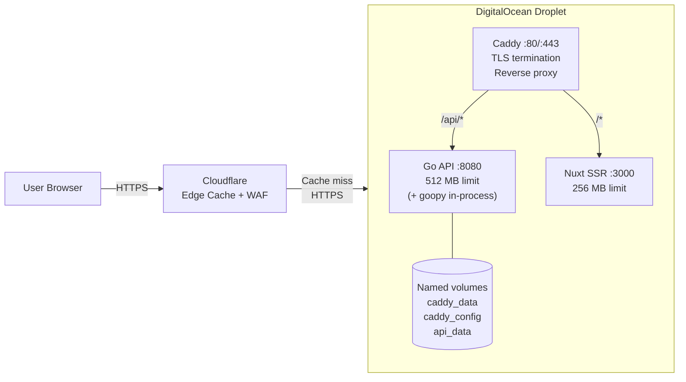

# Deployment

pypx runs as four Docker Compose services behind Caddy, deployed on a DigitalOcean Droplet with Cloudflare in front.

## Infrastructure Overview



## Docker Compose Services

### caddy
```yaml
image: caddy:2-alpine
ports: ["80:80", "443:443"]
memory: 128M
depends_on: [api (healthy), web (healthy)]
```
Handles TLS, routes traffic, adds security headers. Volumes for certificate persistence (`caddy_data`, `caddy_config`).

### api
```yaml
build: ./api
ports: [8080 (internal)]
memory: 512M
volumes: [api_data:/data]
```
SQLite databases stored in the `api_data` named volume (persists across container restarts/redeploys). goopy runs in-process for wheel download and API doc extraction.

### web
```yaml
build: ./web
ports: [3000 (internal)]
memory: 256M
depends_on: [api (healthy)]
```

### Startup order
```
api (healthy) → [web (healthy), caddy]
```

## Caddy Configuration

```
{$DOMAIN:localhost} {
    tls internal (dev) / automatic ACME (prod when DOMAIN is set)

    header {
        X-Content-Type-Options nosniff
        X-Frame-Options DENY
        Referrer-Policy strict-origin-when-cross-origin
        -Server
    }

    handle /api/* { reverse_proxy api:8080 }
    handle         { reverse_proxy web:3000 }
}
```

Caddy trusts Cloudflare's IP ranges for real client IP forwarding (the full CIDR list is in the Caddyfile global block).

## Cloudflare Configuration

See `docs/cloudflare-setup.md` for the full setup guide. Key settings:

**Cache Rules:**
| URL pattern | Edge TTL | Browser TTL |
|---|---|---|
| `pypx.app/api/packages/*/changelog` | 7 days | 7 days |
| `pypx.app/api/packages/*/stats` | 24 hours | 24 hours |
| `pypx.app/api/packages/*` | 1 hour | 1 hour |
| `pypx.app/api/search*` | 5 minutes | 5 minutes |
| `pypx.app/packages/*` | 1 hour | — |

**SSL/TLS:** Full (strict) mode — Cloudflare ↔ origin uses HTTPS (Caddy's auto cert).

**WAF:** Bot management enabled, DDoS protection on.

## Environment Variables

For production deployment, create a `.env` file at the repo root:

```bash
DOMAIN=pypx.app
GITHUB_TOKEN=ghp_...          # Strongly recommended — avoids 60 req/hr GitHub limit
GITLAB_TOKEN=glpat-...        # Optional
```

All other variables have sensible defaults in `docker-compose.yml`.

## Deploying

```bash
# First deploy
git clone https://github.com/mattstrayer/pypx.git
cd pypx
cp .env.example .env && vim .env
docker compose up -d --build

# Update
git pull
docker compose up -d --build

# View logs
docker compose logs -f api
docker compose logs -f web

# Health check
curl https://pypx.app/api/health
```

## Data Persistence

Only the Go API has persistent state — the `api_data` named volume contains:
- `pypx.db` — the TTL cache (can be deleted to clear all cached API responses)
- `pypx.db-search` — the FTS5 search index (rebuilt by background worker in ~5 minutes)
- `pypx.db-search-shm`, `pypx.db-search-wal` — SQLite WAL mode files

All other services are stateless. Redeploying Nuxt has zero data impact.

## Health Checks

| Service | Check command | Interval | Start period |
|---|---|---|---|
| api | `wget -q --spider http://localhost:8080/api/health` | 30s | 10s |
| web | `wget -q --spider http://localhost:3000` | 30s | 15s |

All services have `restart: unless-stopped` — they automatically recover from crashes.
