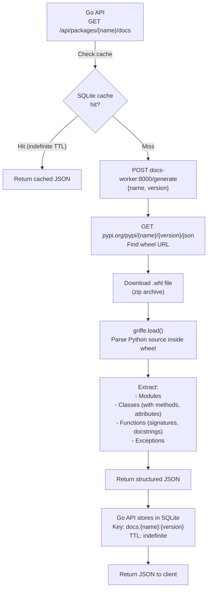

# docs-worker

The docs-worker is a Python ASGI sidecar service that extracts API documentation from published Python wheels. It is the most compute-intensive part of pypx and runs as a separate Docker service to isolate its resource usage.

**Source:** `docs-worker/main.py`  
**Runtime:** Python 3.11+, bare ASGI (no framework)  
**Port:** `8000`

## What it does

Given a package name and version, the docs-worker:
1. Finds the wheel URL from PyPI
2. Downloads the wheel (`.whl` file)
3. Extracts and inspects it with [griffe](https://mkdocstrings.github.io/griffe/)
4. Returns structured JSON with the package's public API surface

This powers the "API Docs" tab on each package page.

## Flow



## Lazy Loading

The docs-worker uses lazy loading for its heavy dependencies (griffe and httpx) to keep the idle container footprint minimal:

```python
# Heavy imports happen only on first request
_griffe = None
_httpx = None

def get_griffe():
    global _griffe
    if _griffe is None:
        import griffe
        _griffe = griffe
    return _griffe
```

This means:
- Cold start from idle: slow (~5–10 seconds for first request)
- Subsequent requests: fast (deps already loaded, result served from Go API cache)

## Response Shape

```json
{
  "name": "requests",
  "version": "2.31.0",
  "modules": [
    {
      "name": "requests",
      "docstring": "Requests HTTP library...",
      "functions": [
        {
          "name": "get",
          "signature": "(url, **kwargs)",
          "docstring": "Sends a GET request.",
          "parameters": [
            { "name": "url", "annotation": "str", "default": null },
            { "name": "kwargs", "annotation": null, "default": null }
          ],
          "returns": "Response"
        }
      ],
      "classes": [...],
      "exceptions": [...]
    }
  ]
}
```

## Timeout Considerations

The Go API gives the docs route a **150-second timeout** (vs. 30s for all other routes). This budget covers:
- PyPI API call to find wheel URL: ~1s
- Wheel download (can be 5–50 MB for large packages): ~5–30s
- griffe parse time: ~1–5s
- Response marshaling: <1s

For very large packages (e.g., scipy, torch), the 150-second budget may still be tight. Errors during extraction are cached for **5 minutes** under `docs-err:{name}:{version}` to prevent hammering the sidecar on repeated page loads for packages that fail.

## Health Check

The sidecar exposes `GET /health` which returns 200. Docker Compose polls this every 10 seconds. The Go API depends on the docs-worker being healthy before starting (`depends_on: docs-worker: condition: service_healthy`).

## Why a Sidecar?

Griffe and the wheel inspection logic require Python. Rather than embedding a Python subprocess in the Go binary or maintaining a separate service, the sidecar pattern keeps the Go API pure Go and lets the Python service be containerized independently. The Go API treats the docs-worker as just another HTTP upstream — the same pattern used for PyPI, GitHub, etc.
