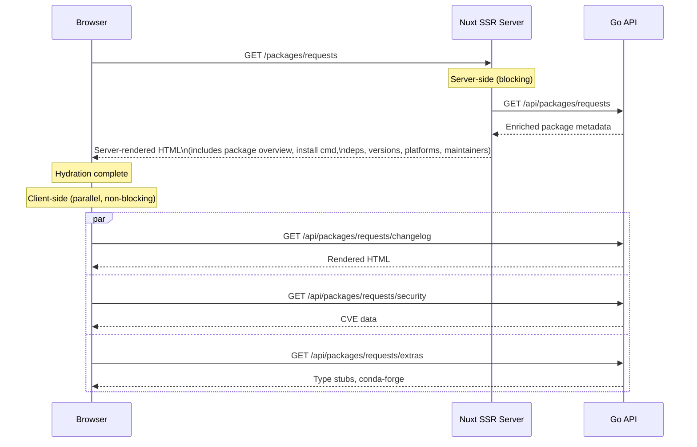

# Frontend

The frontend is a Nuxt 4 application using Vue 3, Tailwind 4, and VueUse. It uses server-side rendering (SSR) for fast initial loads, then hydrates in the browser and loads secondary data in parallel.

**Source:** `web/`  
**Framework:** Nuxt 4.4.2, Vue 3, Tailwind 4  
**Listen port:** `3000`

## Pages

| Route | File | Description |
|---|---|---|
| `/` | `app/pages/index.vue` | Landing page — trending packages, search prompt |
| `/search` | `app/pages/search.vue` | Full search results page |
| `/packages/[name]` | `app/pages/packages/[name].vue` | Main package detail page |
| `/packages/[name]/[version]` | `app/pages/packages/[name]/[version].vue` | Specific version detail |
| `/packages/[name]/docs` | `app/pages/packages/[name]/docs.vue` | API docs tab |

## SSR vs. Client-Side Data Split

The most important design decision in the frontend: not all data is fetched server-side.



**Why this split?**
- Package metadata is critical for the page to be useful — it must be in the server-rendered HTML for SEO and perceived performance.
- Changelog, security, and extras are supplementary — they load asynchronously without blocking the initial render. If they're slow (GitHub API latency, goopy extraction latency), the rest of the page is already interactive.

In code, this is achieved with Nuxt's `useAsyncData`:

```ts
// Server-side — blocks render
const { data: pkg } = await useAsyncData('pkg', () => fetchPackage(name))

// Client-side only — non-blocking
const { data: changelog } = await useAsyncData('changelog',
  () => fetchChangelog(name),
  { server: false }
)
```

## Composables

**`composables/useApi.ts`**  
Central API wrapper. Handles the server vs. client URL difference:
- Server-side: uses `NUXT_API_BASE` (e.g., `http://api:8080`) — direct internal network call
- Client-side: uses `NUXT_PUBLIC_API_BASE` (e.g., `/api`) — browser proxied through Caddy

```ts
const config = useRuntimeConfig()
// On server: config.apiBase = 'http://api:8080'
// On client: config.public.apiBase = '/api'
```

**`composables/useSearchTypeahead.ts`**  
Manages search input state: debounced API calls (150ms), keyboard navigation (arrow keys, Enter, Escape), dropdown open/close state, and loading indicators.

**`composables/usePackageManager.ts`**  
Tracks the active package manager selection (pip / uv / poetry / pipx) and generates the appropriate install command string.

## Command Palette

`components/CommandPalette.vue` implements the `Cmd+K` search interface. It:
- Listens globally for `Ctrl+K` / `Cmd+K`
- Shows a modal with a search input
- Debounces input and calls `/api/search`
- Supports keyboard navigation through results
- Closes on Escape or outside click

## SEO

`@nuxtjs/seo` is configured in `nuxt.config.ts` with site metadata. It automatically generates:
- `<title>` tags per page (package name + "— pypx")
- Open Graph tags (`og:title`, `og:description`, `og:url`)
- `robots.txt` (allows all)
- Canonical URLs

OG image generation is disabled (`ogImage: { enabled: false }`).

## TypeScript Types

`app/types/api.ts` contains TypeScript interfaces that mirror the Go API response shapes. When the Go API's response structure changes, this file must be updated in sync to prevent runtime type errors.

## Tailwind 4

Tailwind is loaded via the Vite plugin (`@tailwindcss/vite`) rather than PostCSS, which is Tailwind 4's recommended setup. No `tailwind.config.js` file — configuration lives in `assets/css/main.css` using CSS-native `@theme` and `@layer` directives.

## Build Config

```ts
// nuxt.config.ts key settings
{
  compatibilityDate: '2026-04-09',
  modules: ['@vueuse/nuxt', '@nuxtjs/seo'],
  runtimeConfig: {
    apiBase: 'http://localhost:8080',        // server-side (overridden by NUXT_API_BASE)
    public: {
      apiBase: '/api',                        // client-side (overridden by NUXT_PUBLIC_API_BASE)
    }
  },
  site: {
    url: 'https://pypx.app',
    name: 'pypx',
  }
}
```
