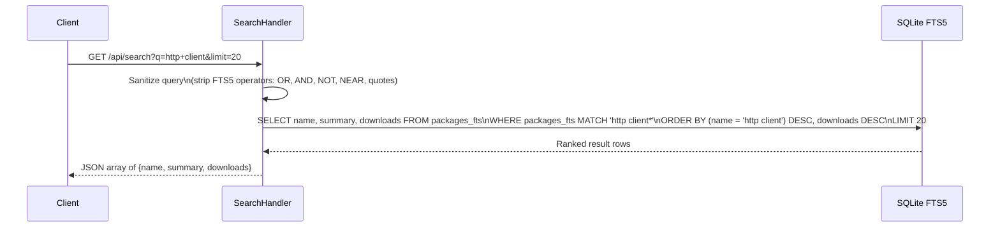
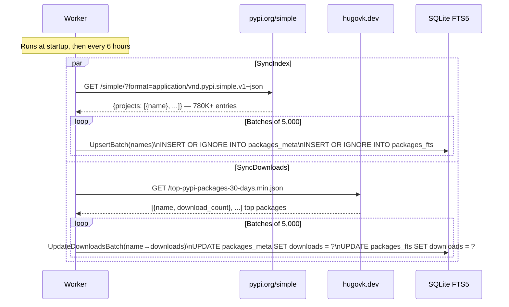

# Search

pypx search is powered by SQLite FTS5 — a full-text search virtual table with porter stemming and unicode normalization. The index covers all 780K+ packages on PyPI and is kept fresh by a background worker.

**Source:** `api/internal/search/index.go`, `api/internal/worker/background.go`

## Index Schema

Two tables, one database file (`pypx.db-search`):

```sql
-- Authoritative data store
CREATE TABLE packages_meta (
    name      TEXT    PRIMARY KEY,
    summary   TEXT,
    downloads INTEGER
);

-- Virtual FTS5 table (linked to packages_meta)
CREATE VIRTUAL TABLE packages_fts USING fts5(
    name,
    summary,
    downloads UNINDEXED,  -- stored but not tokenized
    tokenize='porter unicode61'
);
```

`downloads` is stored in FTS5 as `UNINDEXED` so it can be used for ranking without being tokenized.

## Search Flow



### Query sanitization

FTS5 has special operators (`OR`, `AND`, `NOT`, `NEAR`, `"phrase"`) that can cause syntax errors or unexpected behavior when typed by users. The search handler strips these before querying:
- Removes `OR`, `AND`, `NOT`, `NEAR` keywords
- Removes quote characters
- Appends `*` for prefix matching (so "req" matches "requests")

### Ranking

Results are ranked by two criteria in priority order:
1. **Exact name match first** — `(name = 'query') DESC` puts the exact package at the top
2. **Download count** — `downloads DESC` ranks remaining results by popularity

This means searching "requests" surfaces the `requests` package first, followed by `requests-toolbelt`, `requests-mock`, etc., ordered by how popular they are.

## Background Worker

The worker runs two sync jobs on startup and every **6 hours** thereafter.



### SyncIndex

Fetches the full PyPI Simple API JSON (a single large response containing all 780K+ package names). Upserts them into `packages_meta` and `packages_fts` using `INSERT OR IGNORE` — existing entries are left unchanged to avoid overwriting download counts. Processes in batches of 5,000 with transactions for atomicity and performance.

### SyncDownloads

Fetches the top-packages dataset from hugovk.dev. Updates `downloads` in both tables for the packages that appear in the list. Uses a case-insensitive name match as a fallback since PyPI names are case-normalized but stored values may differ in casing.

### Why separate syncs?

The Simple API gives us names but no download counts. The hugovk dataset gives us download counts but only for the top ~8,000 packages. Separating them means:
- New packages appear in search immediately (from Simple API)
- Popular packages have good ranking signals (from hugovk)
- Obscure packages still appear in search, just with `downloads = 0`

## Popular Packages

`GET /api/popular` calls `index.TopByDownloads(limit)`, which queries `packages_meta` ordered by downloads descending. This is what populates the landing page's trending packages list. Cached for 1 hour.
