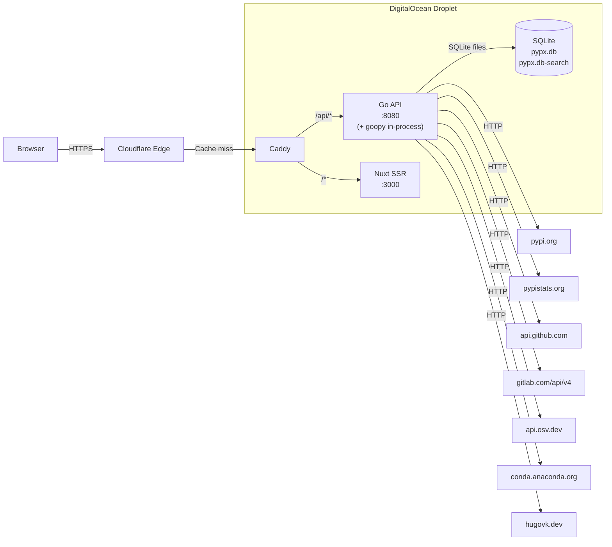
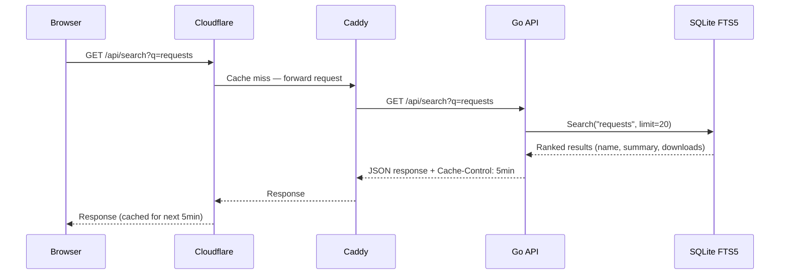
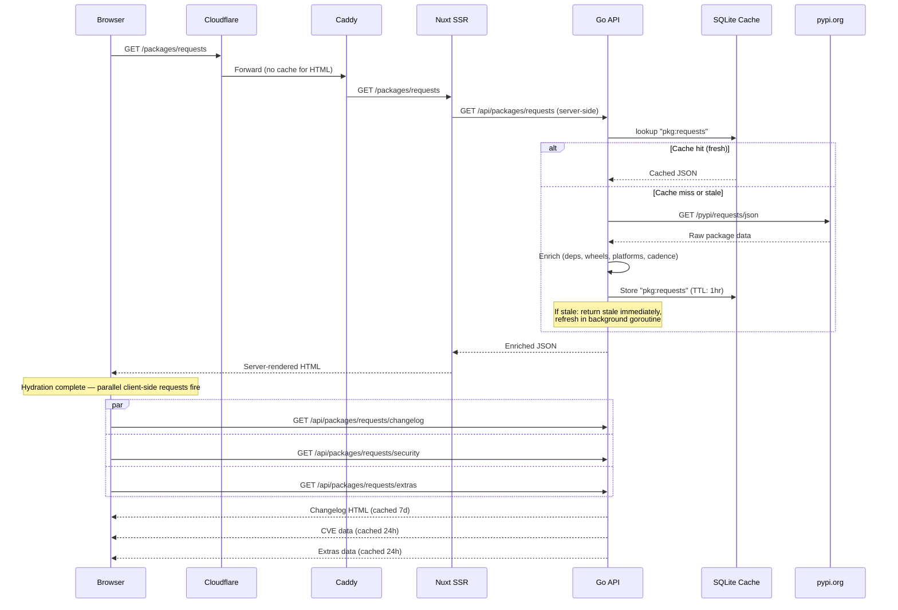

# System Overview

pypx is four cooperating services behind a Caddy reverse proxy, with Cloudflare sitting at the edge.

## Service Map

## Service Roles

### Caddy
The public entry point. Handles TLS termination (automatic certificates from Let's Encrypt). Routes `/api/*` requests to the Go API and all other requests to Nuxt. Adds security headers (`X-Content-Type-Options`, `X-Frame-Options`, `Referrer-Policy`). Trusts Cloudflare proxy IPs for real client IP forwarding.

### Go API (`:8080`)
The data layer. It:
- Fetches from multiple external APIs (PyPI, pypistats, GitHub, GitLab, OSV, conda-forge)
- Enriches raw data (dependency parsing, wheel analysis, Python version extraction, release cadence)
- Caches all results in a two-tier store (memory LRU + SQLite)
- Maintains a full-text search index of 780K+ PyPI packages via a background worker
- Serves JSON to both the Nuxt SSR server and the browser
- Serves plain-text variants for agentic consumers (`/llms.txt`, `*.txt` routes)

### Nuxt SSR (`:3000`)
The presentation layer. It:
- Renders package pages server-side for fast initial loads and SEO
- Fetches critical data (package metadata) blocking on the server
- Hydrates in the browser and fires parallel non-blocking requests for secondary data (changelog, security, docs, extras)
- Serves a Vue 3 SPA after hydration

### goopy (in-process)
API doc extraction runs in-process within the Go API using the goopy library. Given a package name and version, goopy downloads the wheel from PyPI and parses Python source with a recursive-descent parser to extract modules, classes, functions, docstrings, and type annotations, returning structured JSON. Results are cached indefinitely per version.

### SQLite
Two separate database files:
- `pypx.db` — the TTL cache store (all API response caching)
- `pypx.db-search` — the FTS5 full-text search index (package names, summaries, download counts)

Both run with WAL mode enabled for concurrent read performance.

## Full Request Flow

### Search request

### Package page request

## Memory Limits (Docker Compose)

| Service | Memory limit |
|---|---|
| Caddy | 128 MB |
| Go API | 512 MB |
| Nuxt SSR | 256 MB |
